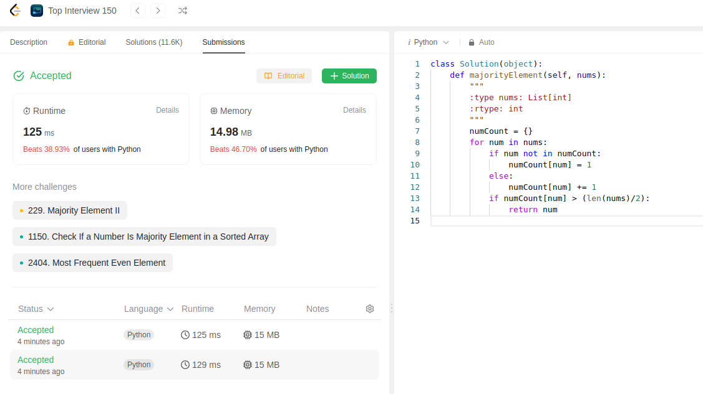
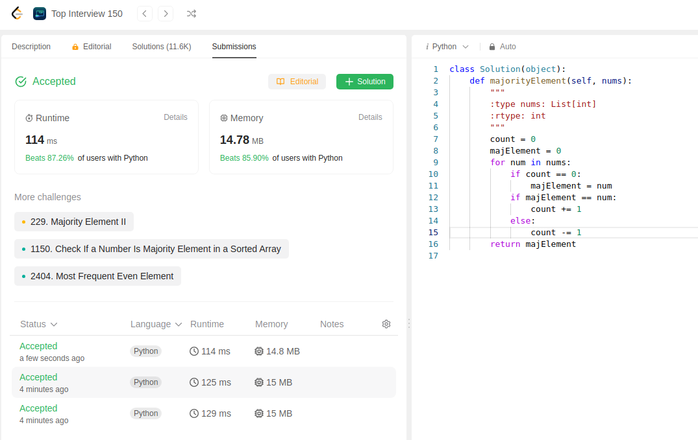

Idea is to find the most repetitive element in the list:

My initial approach:
```python
class Solution(object):
    def majorityElement(self, nums):
        """
        :type nums: List[int]
        :rtype: int
        """
        numCount = {}
        for num in nums:
            if num not in numCount:
                numCount[num] = 1
            else:
                numCount[num] += 1
            if numCount[num] > (len(nums)/2):
                return num
```
In my approach I created a hashmap which keeps track of numbers and their counts.
Whichever number has count greater than half the length of list is returned.

TimeComplexity: O(n)
SpaceComplexity: O(n)

When solution submissted we can see the size is high:


Reducing space complexity with this solution:
```python
class Solution(object):
    def majorityElement(self, nums):
        """
        :type nums: List[int]
        :rtype: int
        """
        count = 0
        majElement = 0
        for num in nums:
            if count == 0:
                majElement = num
            if majElement == num:
                count += 1
            else:
                count -= 1
        return majElement
```

we can see this solution is slightly better
