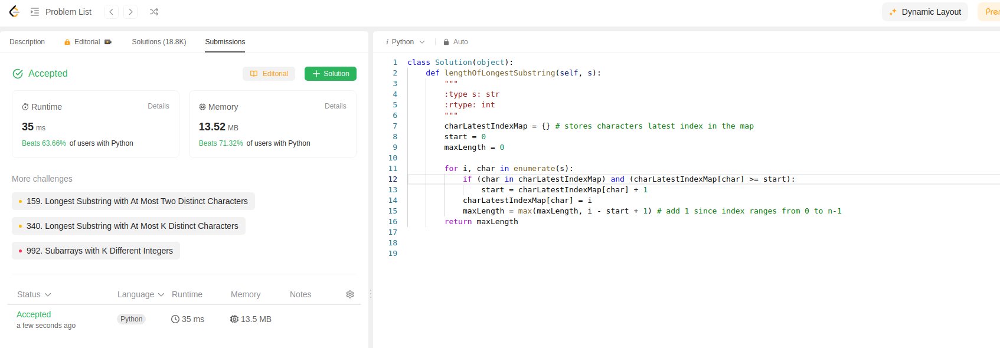

Idea is to find maximum substring length without repeating characters.

Code is below:
```python
class Solution(object):
    def lengthOfLongestSubstring(self, s):
        """
        :type s: str
        :rtype: int
        """
        charLatestIndexMap = {} # stores characters latest index in the map
        start = 0
        maxLength = 0

        for i, char in enumerate(s):
            if (char in charLatestIndexMap) and (charLatestIndexMap[char] >= start):
                start = charLatestIndexMap[char] + 1
            charLatestIndexMap[char] = i
            maxLength = max(maxLength, i - start + 1) # add 1 since index ranges from 0 to n-1
        return maxLength
```

Here, first create an empty hash map, two variables start and maxLength.

start and maxLength are updated while looping characters and index though the string s.

We return the final maxLength.

This is first submission of the day:

