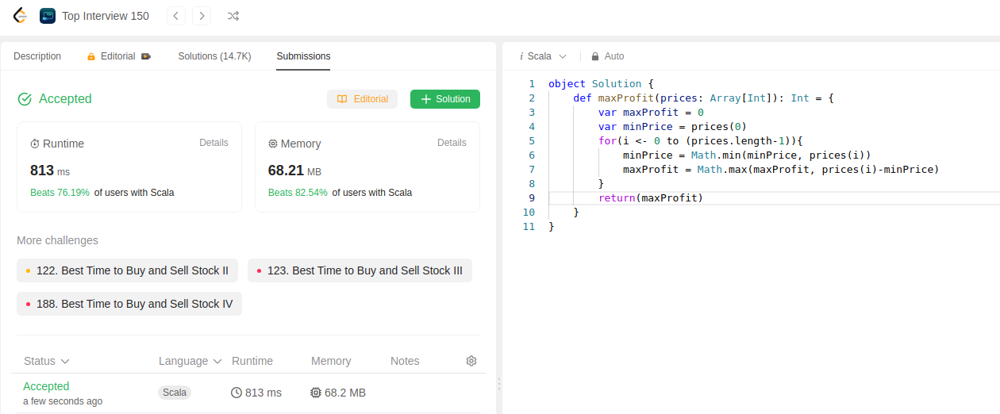

We previously solved this on December 14.

Main idea is to iterate through prices, find the minimum of price and check profit, return max profit.

Now its done in scala.

```scala
object Solution {
    def maxProfit(prices: Array[Int]): Int = {
        var maxProfit = 0
        var minPrice = prices(0)
        for(i <- 0 to (prices.length-1)){
            minPrice = Math.min(minPrice, prices(i))
            maxProfit = Math.max(maxProfit, prices(i)-minPrice)
        }
        return(maxProfit)
    }
}
```

3rd submission of the day.
