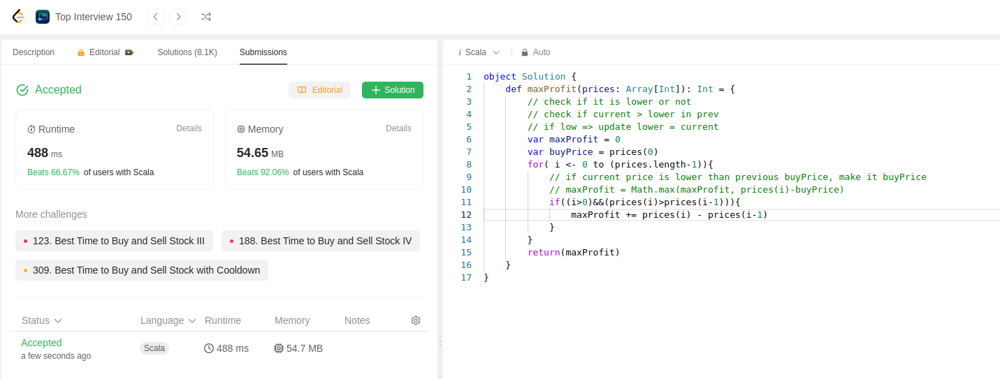

This time it is little different. We need total amount of profit that can be made overall instead of single stock trade as in 121.

Code for it below:
```scala
object Solution {
    def maxProfit(prices: Array[Int]): Int = {
        // check if it is lower or not
        // check if current > lower in prev
        // if low => update lower = current
        var maxProfit = 0
        var buyPrice = prices(0)
        for( i <- 0 to (prices.length-1)){
            // if current price is lower than previous buyPrice, make it buyPrice
            // maxProfit = Math.max(maxProfit, prices(i)-buyPrice)
            if((i>0)&&(prices(i)>prices(i-1))){
                maxProfit += prices(i) - prices(i-1)
            }
        }
        return(maxProfit)
    }
}
```
This is 4th submission of the day
