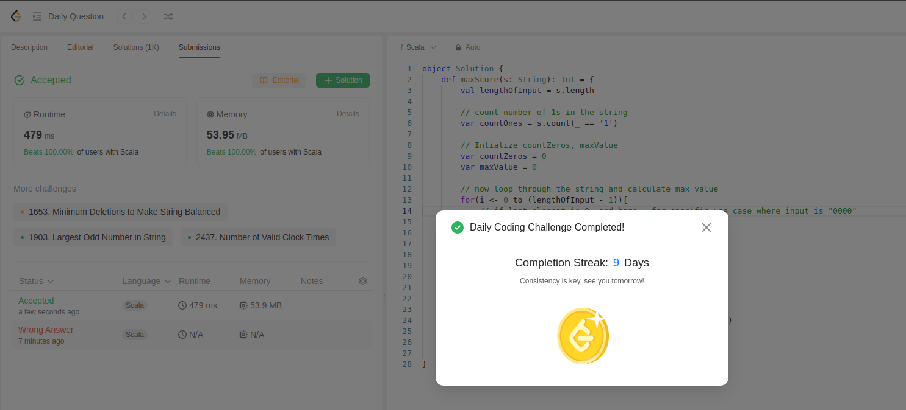

Task is to split the string which has 1s and 0s, then count number of zeros in left split and number of 1s in right split.

To make it memory efficient, we check total number of 1s from start itself.

We initialize maxValue, num. Iterate through the string and at each point we check numZeros and numOnes and add them.

```scala
object Solution {
    def maxScore(s: String): Int = {
        val lengthOfInput = s.length

        // count number of 1s in the string
        var countOnes = s.count(_ == '1')

        // Intialize countZeros, maxValue
        var countZeros = 0
        var maxValue = 0

        // now loop through the string and calculate max value
        for(i <- 0 to (lengthOfInput - 1)){
            // kill loop, no need to go till the end
            if(i == (lengthOfInput - 1)){
                return(maxValue)
            }
            if(s(i)=='0'){
                countZeros += 1
            } else {
                countOnes -= 1
            }

            maxValue = Math.max(maxValue, countZeros + countOnes)
        }
        return(maxValue)
    }
}
```

This is today's daily challenge:
