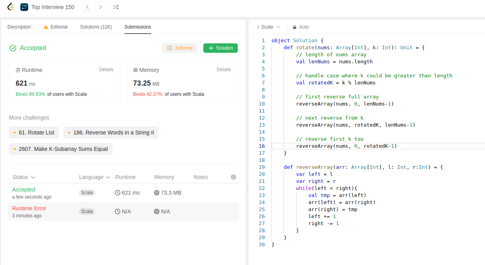

Here we have to rotate an array by k.

This is best achieved by implementing a reversal.

First reverse entire array.
Then reverse first k elements.
Then reverse remaining elements.

Code for same below:
```scala
object Solution {
    def rotate(nums: Array[Int], k: Int): Unit = {
        // length of nums array
        val lenNums = nums.length

        // handle case where k could be greater than length
        val rotatedK = k % lenNums

        // first reverse full array
        reverseArray(nums, 0, lenNums-1)

        // next reverse from k
        reverseArray(nums, rotatedK, lenNums-1)

        // reverse first k too
        reverseArray(nums, 0, rotatedK-1)
    }

    def reverseArray(arr: Array[Int], l: Int, r:Int) = {
        var left = l
        var right = r
        while(left < right){
            val tmp = arr(left)
            arr(left) = arr(right)
            arr(right) = tmp
            left += 1
            right -= 1
        }
    }
}
```

This is first submission of the day:


