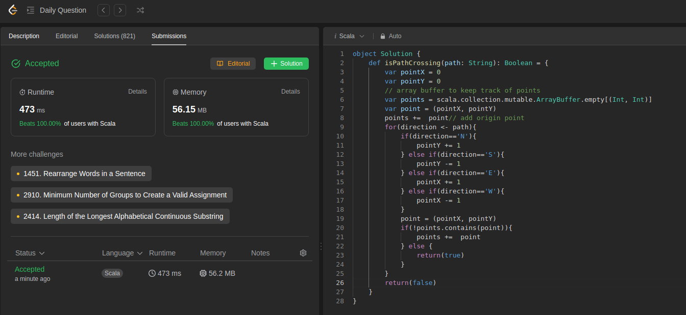

Here, the goal is to determine if the path gives crosses itself.

We determine by simply starting at an origin and updating the point. We store these points in an ArrayBuffer and verify if the point is already present.

If it is already present => path crossing itself => return true

If no such crossing detected, we return false in the end.

```scala
object Solution {
    def isPathCrossing(path: String): Boolean = {
        var pointX = 0
        var pointY = 0
        // array buffer to keep track of points
        var points = scala.collection.mutable.ArrayBuffer.empty[(Int, Int)]
        var point = (pointX, pointY)
        points +=  point// add origin point
        for(direction <- path){
            if(direction=='N'){
                pointY += 1
            } else if(direction=='S'){
                pointY -= 1
            } else if(direction=='E'){
                pointX += 1
            } else if(direction=='W'){
                pointX -= 1
            }
            point = (pointX, pointY)
            if(!points.contains(point)){
                points +=  point
            } else {
                return(true)
            }
        }
        return(false)
    }
}
```

This is today's daily challenge
