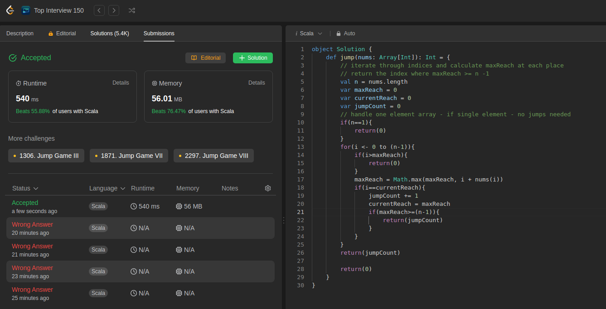

The goal is similar to 55 but here we need the number of jumps to make it to the end. This is done through the Greedy approach.

Code:
```scala
bject Solution {
    def jump(nums: Array[Int]): Int = {
        // iterate through indices and calculate maxReach at each place
        // return the index where maxReach >= n -1
        val n = nums.length
        var maxReach = 0
        var currentReach = 0
        var jumpCount = 0
        // handle one element array - if single element - no jumps needed
        if(n==1){
            return(0)
        }
        for(i <- 0 to (n-1)){
            if(i>maxReach){
                return(0)
            }
            maxReach = Math.max(maxReach, i + nums(i))
            if(i==currentReach){
                jumpCount += 1
                currentReach = maxReach
                if(maxReach>=(n-1)){
                    return(jumpCount)
                }
            }
        }
        return(jumpCount)
        
        return(0)
    }
}
```

This is 2nd submission of the day

