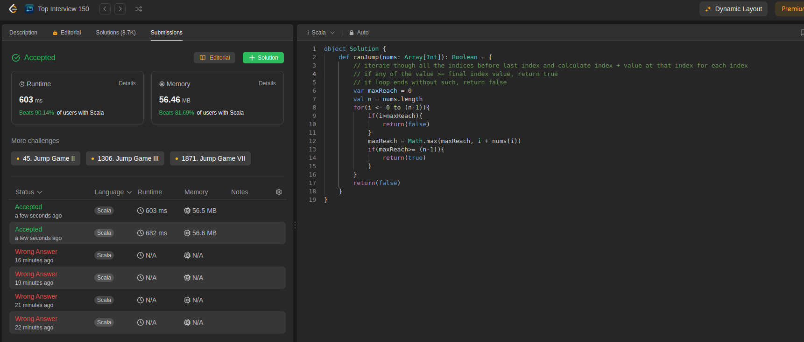

Here, the goal is to find if the values in the array enable it to reach the end.

Code below:
```scala
object Solution {
    def canJump(nums: Array[Int]): Boolean = {
        // iterate though all the indices before last index and calculate index + value at that index for each index
        // if any of the value >= final index value, return true 
        // if loop ends without such, return false
        var maxReach = 0
        val n = nums.length
        for(i <- 0 to (n-1)){
            if(i>maxReach){
                return(false)
            }
            maxReach = Math.max(maxReach, i + nums(i))
            if(maxReach>= (n-1)){
                return(true)
            }
        }
        return(false)
    }
}
```

This is the first submission of the day.

