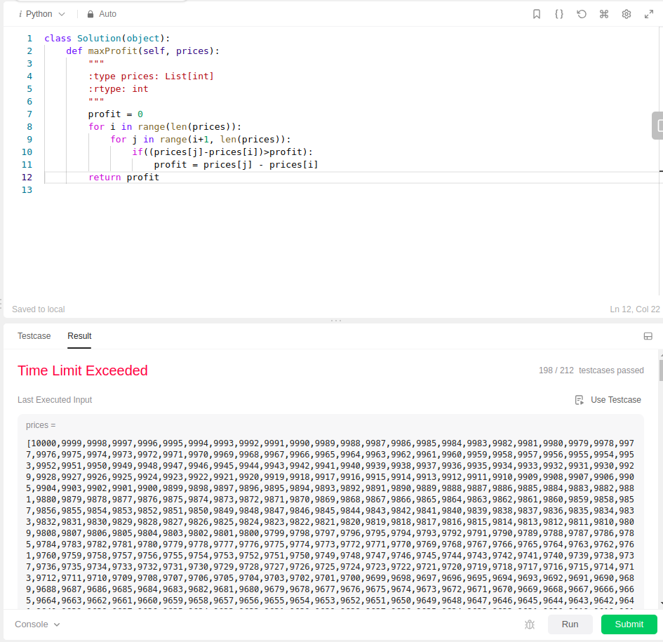
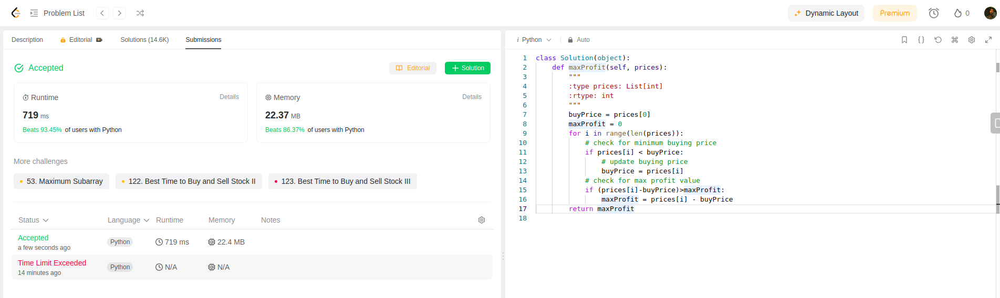

First tried this code:
```python
class Solution(object):
    def maxProfit(self, prices):
        """
        :type prices: List[int]
        :rtype: int
        """
        profit = 0
        for i in range(len(prices)):
            for j in range(i+1, len(prices)):
                if((prices[j]-prices[i])>profit):
                    profit = prices[j] - prices[i]
        return profit
```
This code returns timeout for larger testcases because time complexity is O(n*n)


Have to improve this.

Below approach helped I guess:
```python
class Solution(object):
    def maxProfit(self, prices):
        """
        :type prices: List[int]
        :rtype: int
        """
        buyPrice = prices[0]
        maxProfit = 0
        for i in range(len(prices)):
            # check for minimum buying price
            if prices[i] < buyPrice:
                # update buying price
                buyPrice = prices[i]
            # check for max profit value
            if (prices[i]-buyPrice)>maxProfit:
                maxProfit = prices[i] - buyPrice
        return maxProfit
```

Cool this solution got accepted
