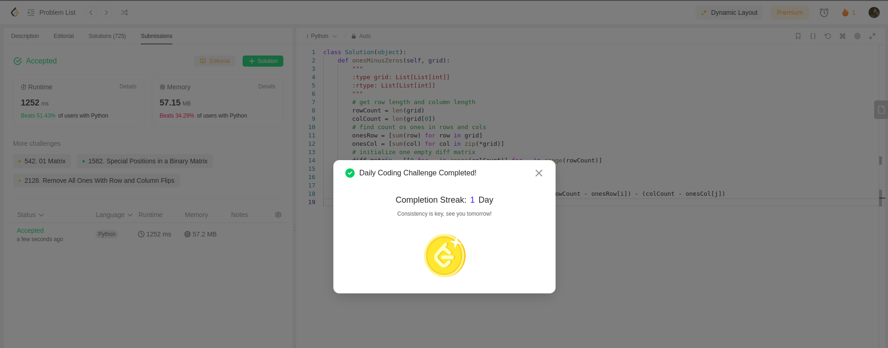

Used below code:
```python
class Solution(object):
    def onesMinusZeros(self, grid):
        """
        :type grid: List[List[int]]
        :rtype: List[List[int]]
        """
        # get row length and column length
        rowCount = len(grid)
        colCount = len(grid[0])
        # find count os ones in rows and cols
        onesRow = [sum(row) for row in grid]
        onesCol = [sum(col) for col in zip(*grid)]
        # initialize one empty diff matrix
        diff_matrix = [[0 for _ in range(colCount)] for _ in range(rowCount)]

        for i in range(rowCount):
            for j in range(colCount):
                diff_matrix[i][j] = onesRow[i] + onesCol[j] - (rowCount - onesRow[i]) - (colCount - onesCol[j]) 
        return diff_matrix
```

So here, we first checked rowCount and colCount.
Then we made two lists which contain info on number of ones in rows and cols respectively.
We instantiated an empty diff matrix.
Then we iterate through rows and columns and compute the difference matrix.

This is my first submission of leet code daily challenge.
