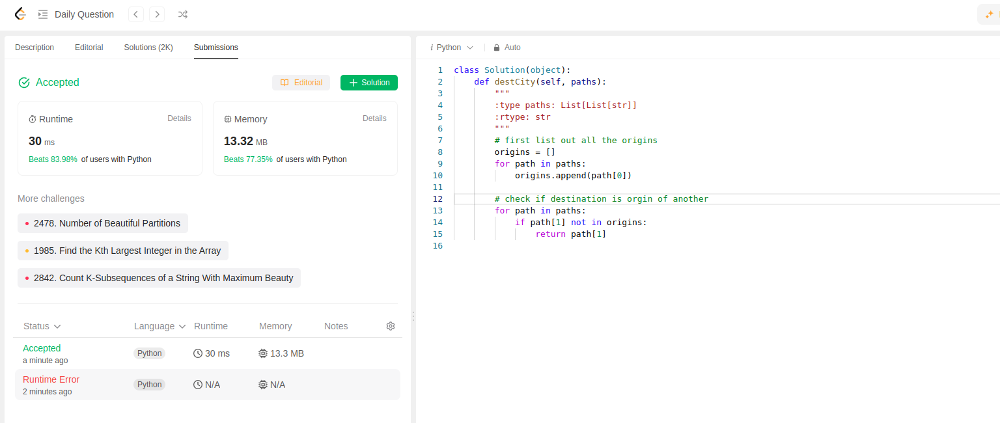

Here is the problem: You are given the array paths, where paths[i] = [cityAi, cityBi] means there exists a direct path going from cityAi to cityBi. Return the destination city, that is, the city without any path outgoing to another city.

It is guaranteed that the graph of paths forms a line without any loop, therefore, there will be exactly one destination city.


For this approach is simple. Create an empty list of all origins and populate it.
Then check if all the destinations are origins of something else. If they are not return them.

```python
class Solution(object):
    def destCity(self, paths):
        """
        :type paths: List[List[str]]
        :rtype: str
        """
        # first list out all the origins
        origins = []
        for path in paths:
            origins.append(path[0])
        
        # check if destination is orgin of another
        for path in paths:
            if path[1] not in origins:
                return path[1]
```

This is 2nd day in daily challenge of leetcode:

