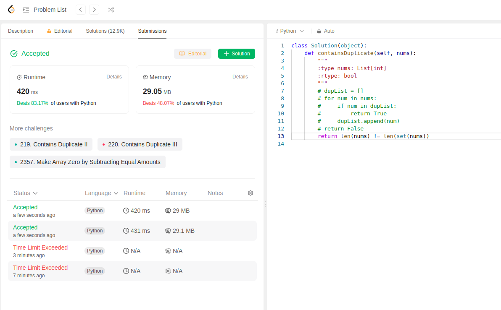

Task is just to return True when list contains duplicates and False if list has no duplicates.

My original solution was this:
```python
class Solution(object):
    def containsDuplicate(self, nums):
        """
        :type nums: List[int]
        :rtype: bool
        """
        dupList = []
        for num in nums:
            if num in dupList:
                return True
            dupList.append(num)
        return False
```

This submission has issue of time out, so later had to settle with this solution below:
```python
class Solution(object):
    def containsDuplicate(self, nums):
        """
        :type nums: List[int]
        :rtype: bool
        """
        return len(nums) != len(set(nums))
```

This solution got submitted.
