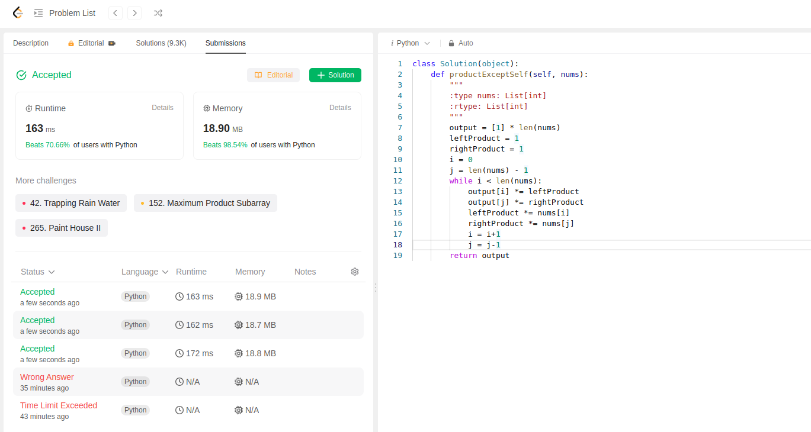

Here we have an input array nums. We have to return an output array such that output[i] is equal to product of all the elements in nums except nums[i].

I tried approach of nested for loops but that got rejected due to time complexity on an extremely large test case.

Other approach is having a left product and right product.

This is the code that got submitted:
```python
class Solution(object):
    def productExceptSelf(self, nums):
        """
        :type nums: List[int]
        :rtype: List[int]
        """
        output = [1] * len(nums)
        leftProduct = 1
        rightProduct = 1
        i = 0
        j = len(nums) - 1
        while i < len(nums):
            output[i] *= leftProduct
            output[j] *= rightProduct
            leftProduct *= nums[i]
            rightProduct *= nums[j]
            i = i+1
            j = j-1
        return output  
```

This is one of the best space complex solutions I have submitted so far.
