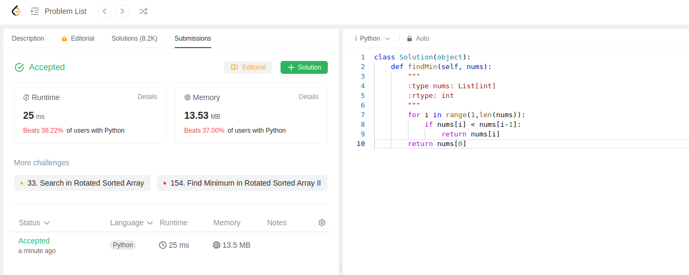

This question is simple, we have a sorted array and it may be rotated. We have to find the minimum in this array.
Code used:
```python
class Solution(object):
    def findMin(self, nums):
        """
        :type nums: List[int]
        :rtype: int
        """
        for i in range(1,len(nums)):
            if nums[i] < nums[i-1]:
                return nums[i] 
        return nums[0]
```

Submission was successful, this is 3rd submission of the day.
