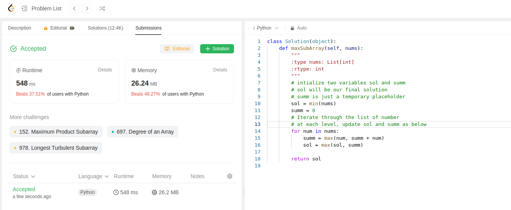

This is a little complicated problem.
We have to find the subarray that has maximum value.

We do that by intializing two variables.
As we iterate through numbers, we update these variables.
Firstly we check if the current number is greater than the sum of previous numbers combined.

then we check against previous highest sum, it keeps updated until we arrive at our ideal solution.
```python
class Solution(object):
    def maxSubArray(self, nums):
        """
        :type nums: List[int]
        :rtype: int
        """
        # intialize two variables sol and summ
        # sol will be our final solution
        # summ is just a temporary placeholder
        sol = min(nums)
        summ = 0
        # Iterate through the list of number
        # at each level, update sol and summ as below
        for num in nums:
            summ = max(num, summ + num)
            sol = max(sol, summ)
        
        return sol
```
Submission was successful
