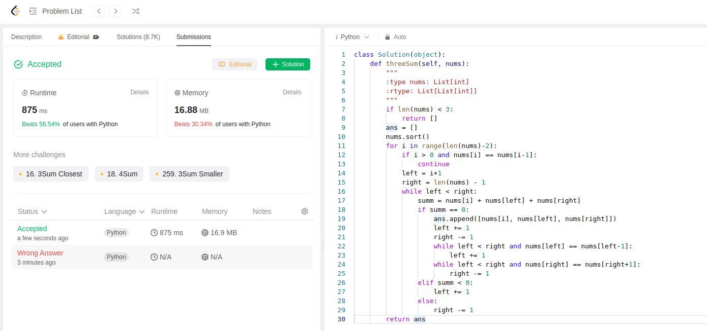

This problem is little complex, took a while to understand even with help of solution.

Here, we are asked to find unique combination of 3 numbers in an array whose sum equals to 0.

To solve, first we check if length of array is less than 3 => we return empty if it is.

Initialize empty answer array.

Sort the numbers array.

Now iterate through each element in array until len(nums)-2.

Inside each iteration, start with left = i+1 and right = len(nums)-1

Check if sum of nums[i], nums[left], nums[right] is equal to 0, if it is append it to ans array and update left and right values.

move left towards right and right towards left i.e., left += 1, right -= 1

Keep checking for duplicates while left < right
nums[left] == nums[left-1]
nums[right] == nums[right-1]

If it is keep update left, right accordingly.

After end of all loops return ans.

```python
class Solution(object):
    def threeSum(self, nums):
        """
        :type nums: List[int]
        :rtype: List[List[int]]
        """
        if len(nums) < 3:
            return []
        ans = []
        nums.sort()
        for i in range(len(nums)-2):
            if i > 0 and nums[i] == nums[i-1]:
                continue
            left = i+1
            right = len(nums) - 1
            while left < right:
                summ = nums[i] + nums[left] + nums[right]
                if summ == 0:
                    ans.append([nums[i], nums[left], nums[right]])
                    left += 1
                    right -= 1
                    while left < right and nums[left] == nums[left-1]:
                        left += 1
                    while left < right and nums[right] == nums[right+1]:
                        right -= 1
                elif summ < 0:
                    left += 1
                else:
                    right -= 1
        return ans
```
This is second submission of the day.


