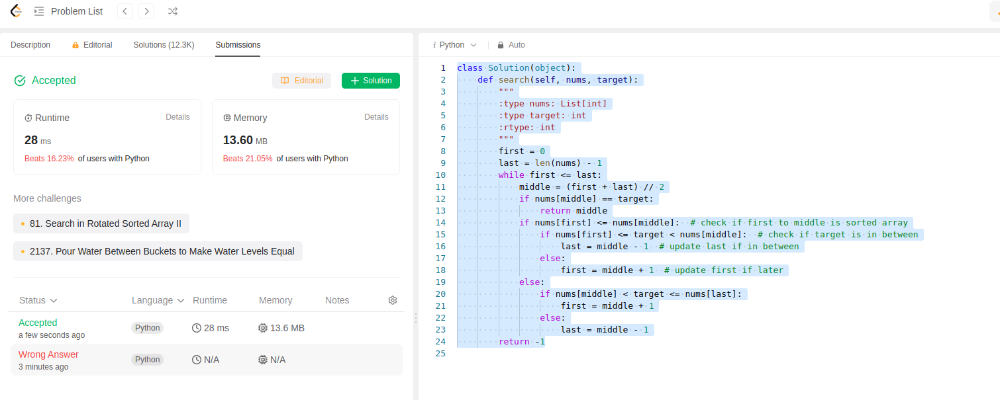

This problem is to search target inside the array which has been sorted and rotated.

This can be solved in two ways, first way is to search in the array and return the index directly. This is of complexity O(n) because if there are n elements in the array and our target happens to be the nth element, it would take n tries to get there.

Since this is a sorted array, we can try Binary search algorithm.

First find the middle point of the array.
Then check if start to middle are sorted, if not then middle to end will be sorted.

Check if target is between start to middle or middle to end. Let's look at one case:

If target is in start and middle, update last value = middle - 1

Code below:
```python
class Solution(object):
    def search(self, nums, target):
        """
        :type nums: List[int]
        :type target: int
        :rtype: int
        """
        first = 0
        last = len(nums) - 1
        while first <= last:
            middle = (first + last) // 2
            if nums[middle] == target:
                return middle
            if nums[first] <= nums[middle]:  # check if first to middle is sorted array
                if nums[first] <= target < nums[middle]:  # check if target is in between
                    last = middle - 1  # update last if in between
                else:
                    first = middle + 1  # update first if later
            else:
                if nums[middle] < target <= nums[last]:
                    first = middle + 1
                else:
                    last = middle - 1
        return -1
```
First submission on day 6.
