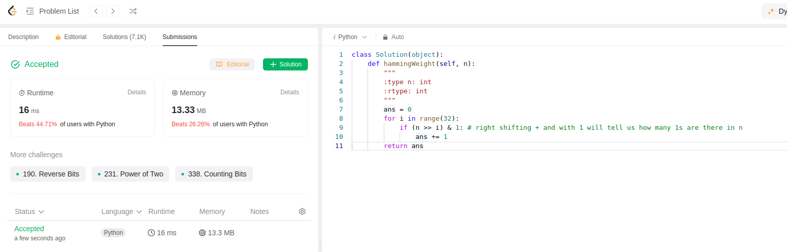

question is to count number of 1 bits in the binary input. We achieve this using right shift operator.

Usually 100 >> 1 => 010
100 >> 2 = 001
100 >> 3 = 000

if we and the right shift output with 1 at every iteration it gives:
010 & 001 = 000
001 & 001 = 001
000 & 001 = 000

Exactly one 1 in 100, we can verify using right shift operator. Code for same below:
```python
class Solution(object):
    def hammingWeight(self, n):
        """
        :type n: int
        :rtype: int
        """
        ans = 0
        for i in range(32):
            if (n >> i) & 1: # right shifting + and with 1 will tell us how many 1s are there in n
                ans += 1
        return ans
```

This is second submission of the day.
