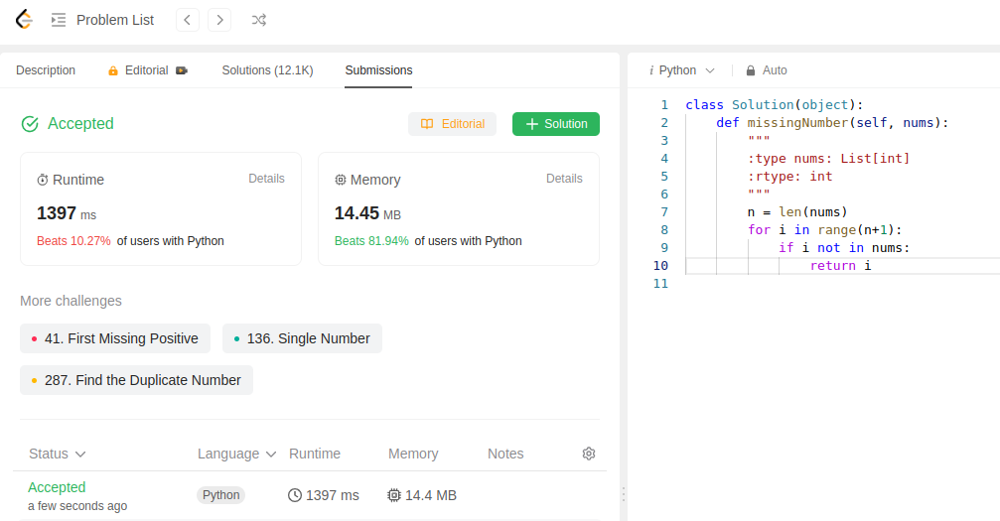

Finding missing number:
```python
class Solution(object):
    def missingNumber(self, nums):
        """
        :type nums: List[int]
        :rtype: int
        """
        n = len(nums)
        for i in range(n+1):
            if i not in nums:
                return i
```
we iterate through range and check if the number is in array or not.

This is 3rd submission of the day:
