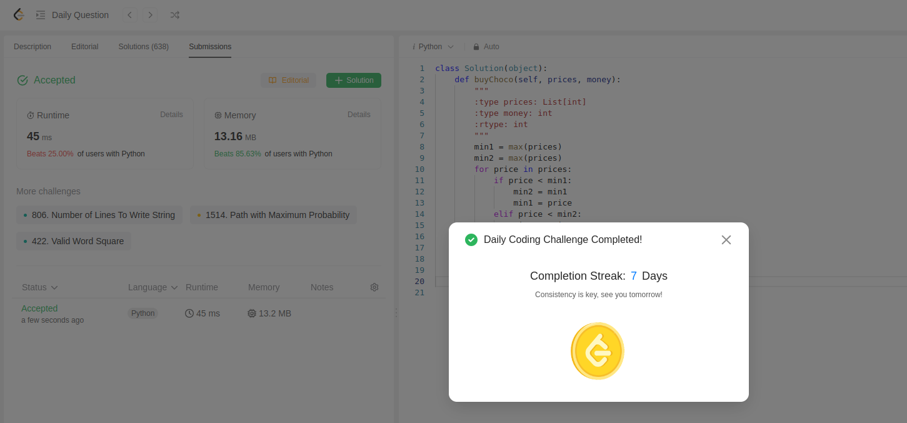

We have to buy two chocolates in a way that we have some money or 0 left.

Code below:
```python
class Solution(object):
    def buyChoco(self, prices, money):
        """
        :type prices: List[int]
        :type money: int
        :rtype: int
        """
        min1 = max(prices) 
        min2 = max(prices)
        for price in prices:
            if price < min1:
                min2 = min1
                min1 = price
            elif price < min2:
                min2 = price

        if (money-(min1+min2)) >= 0:
            return money-(min1+min2)
        else:
            return money
```

This is the 2nd submission of the day and daily challenge.
