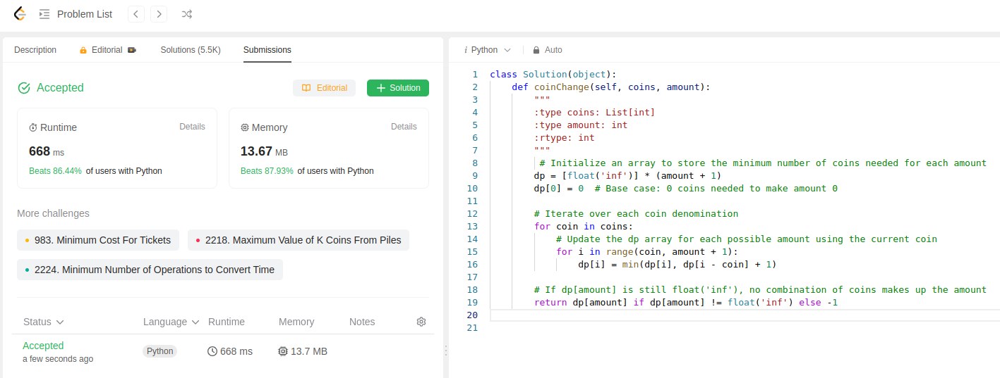

This question ams to find the least number of coins at a denomination available.
code below:
```python
class Solution(object):
    def coinChange(self, coins, amount):
        """
        :type coins: List[int]
        :type amount: int
        :rtype: int
        """
         # Initialize an array to store the minimum number of coins needed for each amount
        dp = [float('inf')] * (amount + 1)
        dp[0] = 0  # Base case: 0 coins needed to make amount 0

        # Iterate over each coin denomination
        for coin in coins:
            # Update the dp array for each possible amount using the current coin
            for i in range(coin, amount + 1):
                dp[i] = min(dp[i], dp[i - coin] + 1)

        # If dp[amount] is still float('inf'), no combination of coins makes up the amount
        return dp[amount] if dp[amount] != float('inf') else -1
```
First we initialize an array to store minimum number of coins required and mark then infinity

Let's go through an example using the given `coins = [1, 2, 5]` and `amount = 11`. We'll step through the iterations of the dynamic programming approach to fill in the `dp` array.

Initially, the `dp` array is initialized as follows:
```
dp = [0, inf, inf, inf, inf, inf, inf, inf, inf, inf, inf, inf, inf]
```

Now, let's iterate through the coins and update the `dp` array:

1. **Coin 1:**
   - For each amount from 1 to 11, update `dp[i]` with `min(dp[i], dp[i-coin] + 1)` if the new value is smaller.
   ```
   dp = [0, 1, 2, 3, 4, 5, 6, 7, 8, 9, 10, 11, inf]
   ```

2. **Coin 2:**
   - Update the `dp` array similarly:
   ```
   dp = [0, 1, 1, 2, 2, 3, 3, 4, 4, 5, 5, 6, inf]
   ```

3. **Coin 5:**
   - Update the `dp` array again:
   ```
   dp = [0, 1, 1, 2, 2, 1, 2, 2, 3, 3, 2, 3, inf]
   ```

After the iterations, the final `dp` array is obtained. The value at `dp[11]` is 3, indicating that the fewest number of coins needed to make up the amount 11 is 3. Therefore, the function will return 3 for the given example.

This is sixth submission of the day
