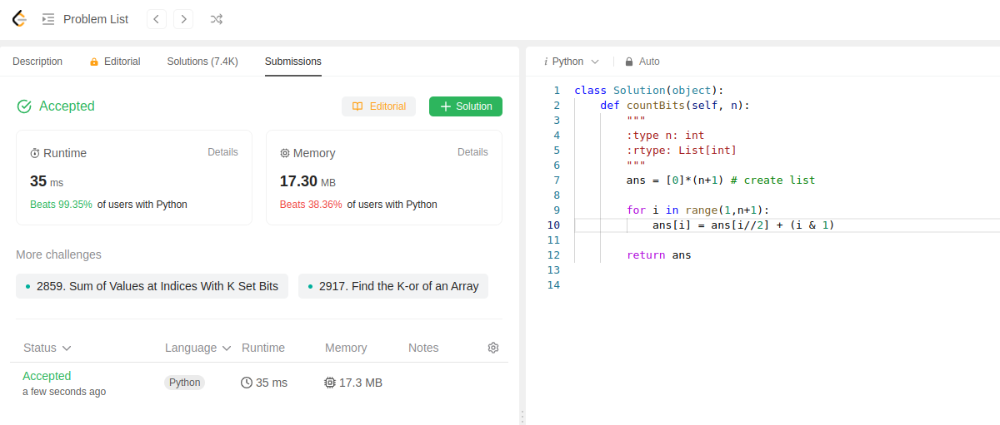

Here we have to find the number of bits in numbers until n and print them in an array.

Code is below:
```python
class Solution(object):
    def countBits(self, n):
        """
        :type n: int
        :rtype: List[int]
        """
        ans = [0]*(n+1) # create list 

        for i in range(1,n+1):
            ans[i] = ans[i//2] + (i & 1)
        
        return ans
```
Here, we create empty list.
We iterate through numbers from 1 to n.
Divide the number by 2 (floor divison) plus number and by 1

This is first submission of the day.
