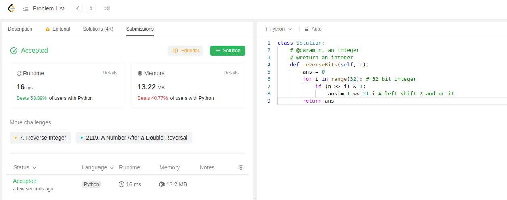

Goal is to reverse bits in 32 bit integer (100 -> 001 if 3 bits)

Code is below:
```python
class Solution:
    # @param n, an integer
    # @return an integer
    def reverseBits(self, n):
        ans = 0
        for i in range(32): # 32 bit integer
            if (n >> i) & 1:
                ans|= 1 << 31-i # left shift 2 and or it
        return ans
```
First initialize ans as 0
Iterate through 0th to 31st bit -> check if the ith bit is 1 by right shifting the number by i and doing an "and" operation with it with 1
If we find 1, place 1 in (31-i)th position by left shifting the answer and placing 1 there.

finally return answer

This is 4th submission of the day:
