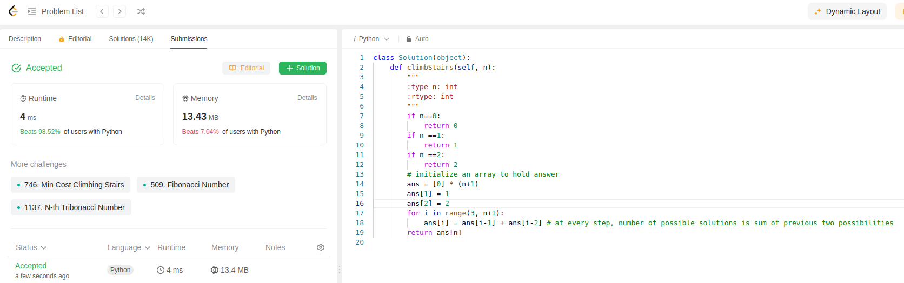

Here we are counting number of unique ways to climb stairs. User can take 1 step at a time or 2 steps at a time.

So number of solutions at n is sum of previous two
ans[n] = ans[n-1] + ans[n-2]

We used this principle and recursion in code below:
```python
class Solution(object):
    def climbStairs(self, n):
        """
        :type n: int
        :rtype: int
        """
        if n==0:
            return 0
        if n ==1:
            return 1
        if n ==2:
            return 2
        # initialize an array to hold answer
        ans = [0] * (n+1)
        ans[1] = 1
        ans[2] = 2
        for i in range(3, n+1):
            ans[i] = ans[i-1] + ans[i-2] # at every step, number of possible solutions is sum of previous two possibilities
        return ans[n]
```

This is fifth submission of the day
